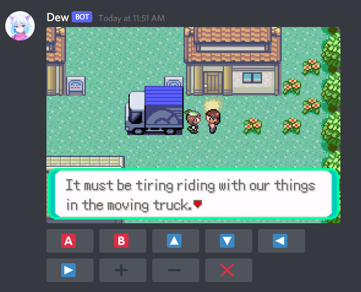

# Dew
### The Discord Emulation Witch
[Discord Server](https://discord.gg/aRvXdEtrnq)

Dew is a Discord bot that allows people on a Discord server to play any [libretro](https://github.com/libretro/) compatible emulator.  
The bot counts the number of button press since the last simulation, emulates the game for a given duration with the selected input and sends a new message with a GIF of the simulated frames.   
It is based on [Discord.Net](https://github.com/discord-net/Discord.Net) and [SK.Libretro](https://github.com/Skurdt/SK.Libretro).  

# Pre-Reqs
.NET Core 3.1

# How to
1) Clone this repo
2) Create a **new Discord bot** from the [developer portal](https://discord.com/developers/applications)
3) Create an invite link with **messaging and message managing**
5) Go to **src/Settings.cs**
6) Edit the file like this:
   * **BotId**: the Id of your bot
   * **ChannelId**: the channel in which your bot will be sending messages
   * **Core**: the name of the emulator you will be using (without _libretro.dll)
   * **RomName**: the name of the game rom (without the extension)
7) In your console go to the **src** folder and compile the project with `dotnet build --configuration Release`
8) Go to bin/Release/netcoreapp3.1 and create a file named **token** (without any extension) that contains your bot token
9) In netcoreapp3.1, create new folders like this: **netcoreapp3.1/libretro/cores**
10) Download the **core** you want to use [here](https://buildbot.libretro.com/nightly/) and place it in the **cores folder**
11) Place your **game rom** in the netcoreapp3.1 folder and run the bot

# Customizing inputs
You can modify the Buttons array from the Settings class to customize inputs
This is mostly useful in cases where you want to have longer movements or turbo press
 
The button is composed of 3 variables:  
1) The Id of the libretro button
2) The UTF value of the emoji or text your want to be displayed
3) The function that is used to determine wether or not the button is pressed

Here are basic examples of press functions:
1) (frame) => true  
   Press the button for the whole duration of the gif  
2) (frame) => frame < 16  
   Press the button until frame 15 (included)
3) (frame) => frame % 5 == 0  
   Press the button every 5 frames, starting at frame 5  